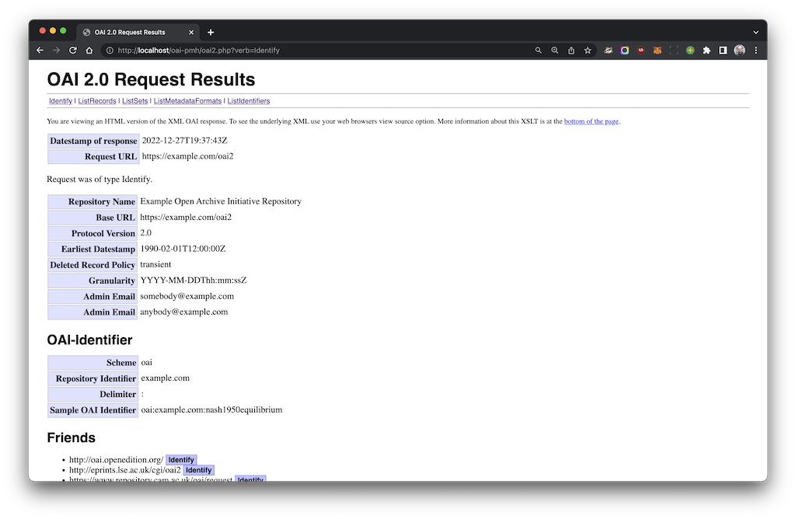

# oai-pmh

A simple OAI-PMH 2.0 server written in PHP. 

## Features

- [x] [OAI v2](http://www.openarchives.org/OAI/openarchivesprotocol.html) compliant
- [x] Multi-repositories
- [x] Per-repository deleted record policy, harvesting granularity, incomplete list size, and resumption token duration
- [x] Provides a set of classes to help setup the metadata updating process
- [x] Access and update logging

TODO:

- [ ] Fix `oai2.xsl` (line 530): should display "No more results" when `oai:resumptionToken` is present but empty
- [ ] Support (per-repository) log levels: `access`, `error`, `no`

## Prerequisites

* MySQL 5.7+
* http server w/ PHP 7.1+

## Installation

### Create the MySQL database

First, create the MySQL database `oai_repo` and setup a small demo repository.

```
$ cd install
$ mysql -u root -p
...
mysql> source setup_database.sql
...
mysql> source setup_demo_repo.sql
mysql> exit

```

If the database `oai_repo` already exists, the SQL scripts `setup_database.sql` and `setup_demo_repo.sql` will do nothing. Therefore, if you want to completely reinstall the database (wiping out all the repositories you might have setup), you must delete the database first. See below. To only factory reset the demo repository, you must delete the demo repository record first. See also below.

### Configure your HTTP server

Add a new site with `public` as document root folder.

Assuming the base URL of the site is `http://localhost/oai-pmh`, point your browser to `http://localhost/oai-pmh/oai2.php?verb=Identify`. 

You should get:



Note that for now the base URL and request URL in this response are wrong, and as such the demo repository is not fully OAI compliant.


## Uninstallation

The following SQL statements wipes out the entire database and then delete the associated user: 

```sql
DROP DATABASE IF EXISTS `oai_repo`;
DROP USER IF EXISTS 'oai_user'@'localhost';
```

Be careful, since all the repositories that you might have set up will be lost.

Then, reconfigure your http server to remove the associated web site. 

## Adding a new repository

There is no dedicated GUI to manage repositories. To do so you have to use SQL directly, or through a GUI like, e.g., phpmyadmin. The database schema is simple, and quite self-explanatory provided you have a basic knowledge of the OAI-PMH protocol.

Since OAI 2.0 compliant repositories must disseminate, at least, Dublin Core, a minimal repository could be created with SQL queries like:

```sql
INSERT INTO `oai_repo` (`id`, `repositoryName`, `baseURL`, `protocolVersion`, `adminEmails`, `earliestDatestamp`, `deletedRecord`, `granularity`) 
VALUES ('myrepo', 'My Repo', 'http://example.com/oai2.php', '2.0', 'me@example.com', '2019-01-01', 'no', 'YYYY-MM-DD');

INSERT IGNORE INTO `oai_meta` (`repo`, `metadataPrefix`, `schema`, `metadataNamespace`) 
VALUES ('myrepo', 'oai_dc', 'http://www.openarchives.org/OAI/2.0/oai_dc.xsd', 'http://www.openarchives.org/OAI/2.0/oai_dc/');
```

The identifier of this repository in the database is `myrepo`. In that example, the repository does not support deleted records or incomplete lists, has day granularity, no repository description, no sets, and is empty.

To be able to browse this repository using a web browser, you need a custom PHP script. 

The script `public/oai2.php` is customized for the `demo` repository. If you want to reuse it for your new repository, edit it and change the line:

```php
define('REPO_ID', 'demo');
```

to

```php
define('REPO_ID', 'myrepo');
```

Each repository must have its own base URL. Therefore, if you want to keep the existing repositories, make a copy of `public/oai2.php` under a new name before updating `REPO_ID`. Update the repository definition in the database (table `oai_repo`) to reflect the new base URL for this repository.  

You may also want to tweak your http server to get a nice base URL, without the `.php` part.


## Deleting a repository

To delete a repository, just delete the corresponding record in the table `oai_repo`. Foreign key constraints ensure that all data associated with this repository will be properly deleted, including log data.

For instance, to delete the repository `demo`, execute the following SQL statement:

```sql
DELETE FROM oai_repo.oai_repo WHERE id='demo';
```

If you want to keep log data, you should take the repository offline instead, by modifying its PHP script. You may also want to save storage space by emptying the repository, that is, deleting all associated metadata and set membership data: 

```sql
DELETE FROM oai_repo.oai_item_meta WHERE repo='demo';
DELETE FROM oai_repo.oai_item_set WHERE repo='demo';
```
## Adding metadata to a repository

### Overview

Once a repository is created, an automated process to add, delete, or update metadata and membership data must be put in place. No such functionalities are part of the OAI protocol itself. 

From a technical point of view, such an automated process is highly dependent on the ultimate source for these metadata and membership data. For instance, it could be:

* a local or a remote database, possibly using a completely different technology or schema as the ones used in this OAI-PMH implementation
* a OAI-PMH repository, which therefore needs to be "harvested"
* an XML document containing metadata in a different format, that need to be read and transformed through XSL, before being imported into the repository
* a plain text file

Therefore, the implementation of the update process is likely to be very specific to your data source, and it thus requires a specific development. The project aims to help you in this endeavour, by providing a base class on which a full update process can be implemented.

### Procedure

To help you build the specific solution that best fits your situation, you may use the class `Oai_Updater`. This class offers several abstract methods needed to update the repository. These abstract methods must be implemented in a derived class of your own:

| Abstract method  | Parameters   | Description   |
|------------------|--------------|---------------|
| `objects()`      | `$identifierArray`, `$from`, `$to`, `$noDeleted`, `$set` | Return an array of iterable lists of source objects, where objects' primary keys in the source data are in `$identifierArray`, objects have been modified between  `$from`, `$to`, are not currently deleted (if `$noDeleted` is `true`), and belong to the set of SetSpec `$set`. |
| `nextObject()` | `&$r` | Return the next source object from an iterable list of source objects `$r`. |
| `metadata()` | `$f`, `$metadataPrefix` | Return a string containing the metadata of the source object `$f`, in format `$metadataPrefix`. |
| `about()` | `$f`, `$metadataPrefix` | Return an array of strings, each one containing xml data about the metadata of the source object `$f`, in format `$metadataPrefix`. |
| `deleted()` | `$f` | Return `true` if the source object `$f` is currently deleted. |
| `datestamp()` | `$f` | Return the modification date of the source object `$f`. |
| `id()` | `$f` | Return the primary key of the source object `$f`. |
| `identifier()` | `$id` | Return the OAI identifier of the corresponding to the primary key `$id`. |


### Example
As an implementation example, a php script to update the demo repository using an XML file containing a collection of `mods` elements is provided.

The XML file is `install/demo_data.xml`. It is a mods document containing `mods` data for 6 famous publications by John Nash:

```xml
<?xml version="1.0" encoding="UTF-8"?>
<modsCollection xmlns="http://www.loc.gov/mods/v3">
<mods ID="nash1950equilibrium">
    <titleInfo>
        <title>Equilibrium points in n-person games</title>
    </titleInfo>
    <name type="personal">
        <namePart type="given">John F.</namePart>
        <namePart type="family">Nash</namePart>
        <role>
            <roleTerm authority="marcrelator" type="text">author</roleTerm>
        </role>
    </name>
    ...
```
This document has been created using `bib2xml`. We observe that it lacks schema location attributes and related namespaces, and that each `mods` element has an attribute `ID` that will serve as a primary key.

Since the demo repository offers two metadata formats, `oai_dc` and `mods`, the example implementation generates `oai_dc` from `mods`, on-the-fly, using a transformation. An XSLT stylesheet to transform a mods document into a oai_dc document is available at the [MOD's Official Web Site](https://www.loc.gov/standards/mods/). To download the stylesheet where the updater will look for, do:

```sh
cd public/xsl
wget "https://www.loc.gov/standards/mods/v3/MODS3-8_DC_XSLT1-0.xsl"
```

In the example implementation, a first derived class `Oai_XmlUpdater` handles the XML metadata formats by implementing the abstract method `metadata()`. This class is itself derived in a class `Oai_DemoUpdater` which implements the other abstract methods.

Once the stylesheet has been downloaded, the repository can be updated. The following URL updates the demo repository, adding five new publications from the file `demo_data.xml`, in both of the two supported metadata formats, assigning all the records to the set `pub:(econ)`:

`http://localhost/oai-pmh/update_demo_repo.php?metadataPrefix=oai_dc,mods&set=pub:(econ)`

Various indicators and metrics about the update process are stored in the table `oai_repo.oai_update_log`.


## Contributing

Before submitting a pull request, please check your code with:

```sh
php-cs-fixer fix . --dry-run --diff --rules=@Symfony
``` 

You might also want to test that your changes do not break OAI compliance, using a validator, e.g.:

* [http://validator.oaipmh.com](http://validator.oaipmh.com)
* [http://oai.clarin-pl.eu](http://oai.clarin-pl.eu)


## Author

* **Christophe Bisière** 

## License

* This php scripts are licensed under the GNU General Public License v3.0 - see the [LICENSE](LICENSE) file for details. 
* The file `./public/xsl/oai2.xsl` has been written by Christopher Gutteridge, University of Southampton, and is GPL 2+. 


